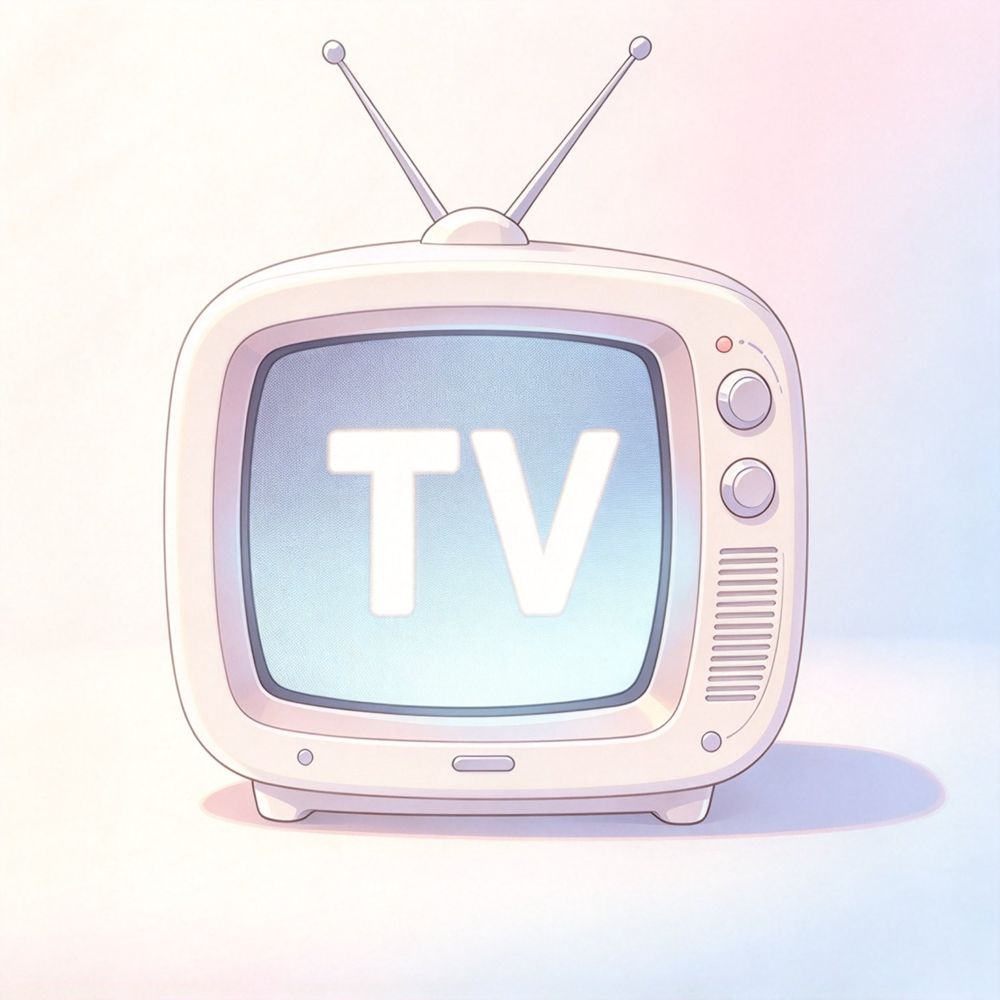
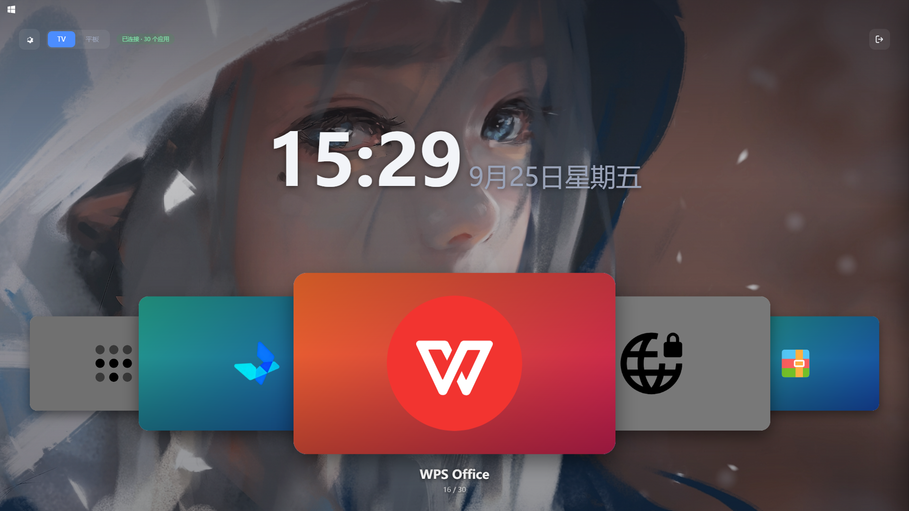
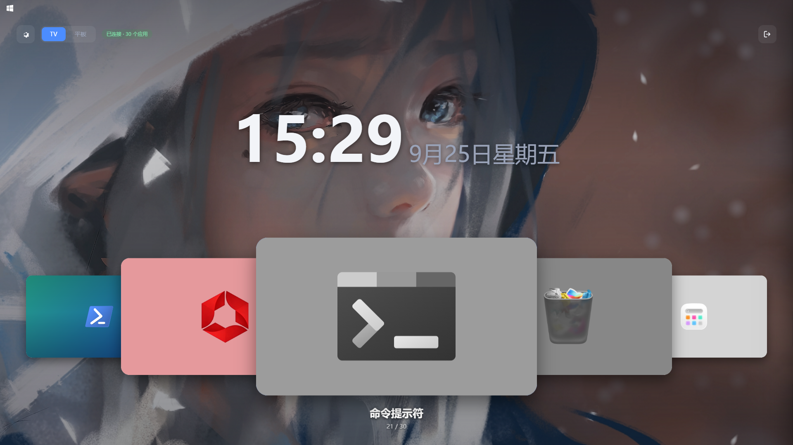
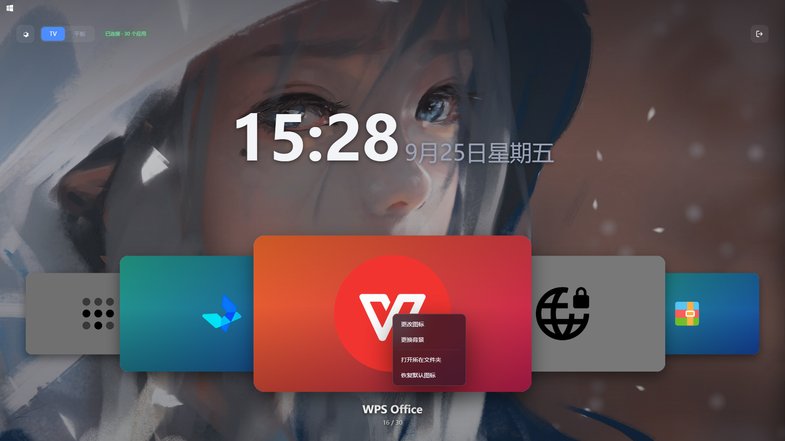
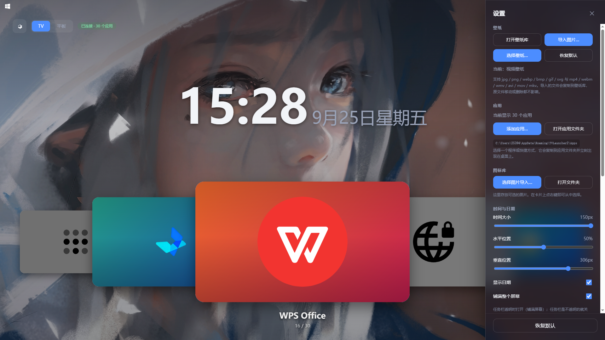
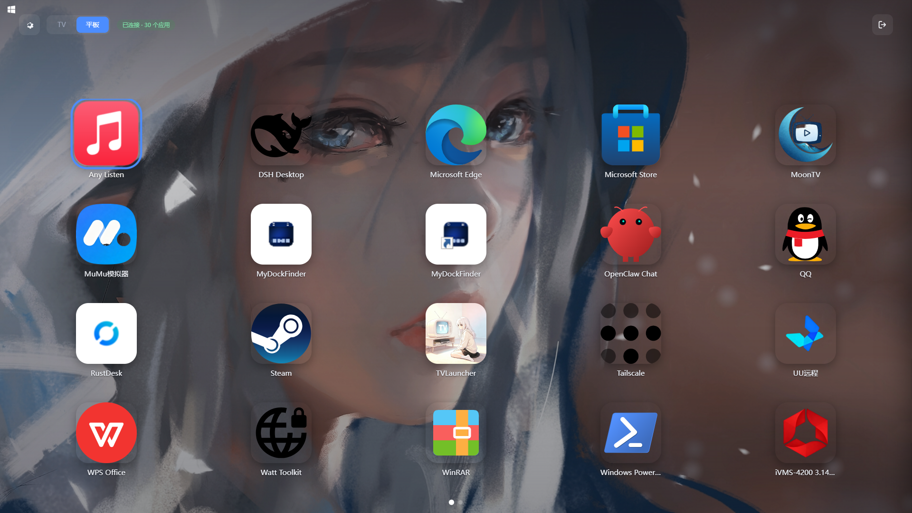
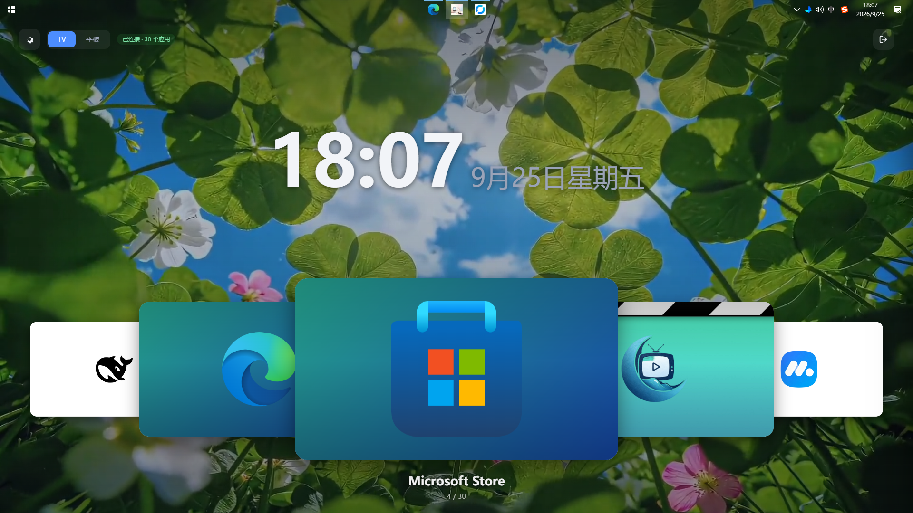
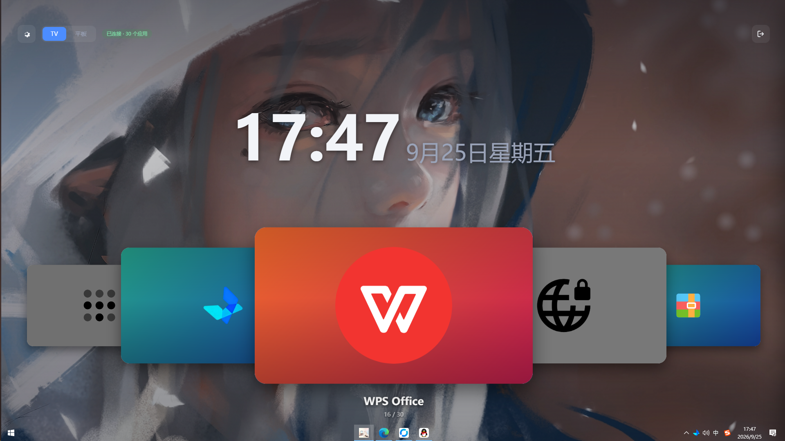

<div align="center">



# TVLauncher

**把 Windows 桌面变成一个能用遥控器操作的电视**

TV 封面流 · 平板网格 · 毛玻璃界面 · 键盘 / 手柄 / 鼠标全支持

[](#环境要求)
[](#从源码构建)
[](#它是如何工作的)
[](LICENSE)

[功能特性](#功能特性) · [安装](#安装) · [使用](#使用) · [它是如何工作的](#它是如何工作的) · [从源码构建](#从源码构建)

</div>

---

## 这是什么

TVLauncher 是一个 Windows 桌面启动器。仅需1个飞鼠，即可使电脑获得电视的启动体验。它不像普通程序那样以窗口形式存在，而是**变成桌面本身**——永久贴在原生桌面之上、所有普通窗口之下，任务栏清清楚楚地露在外面。

它提供两种浏览方式：

- **TV 模式**——重叠的封面流，居中的卡片最大最亮，左右两侧的卡片向后层层堆叠。适合用遥控器或者手柄，一个方向键就能换一个应用。
- **平板模式**——整页的网格，一屏放下所有应用。适合鼠标和触摸。

两者可以随时切换，界面会跟着滑动过去。

<div align="center">



*TV 模式：重叠封面流，卡片支持自定义背景与图标*

</div>

---

## 功能特性

### 两种浏览模式

| TV 模式 | 平板模式 |
|---|---|
| 重叠封面流 | 分页网格 |
| 居中卡片最大，两侧递减 | 每页行列数可调 |
| 方向键 / 滚轮 / 拖拽切换 | 方向键 / 滚轮 / 上下页键 |
| 切换有回弹动画 | 翻页有滑动动画 |
| 进入时卡片从中间展开 | 图标依次错峰出现 |

<div align="center">



*卡片背景可以是图片，也可以是纯色；图标与背景分开设置*

</div>

### 卡片外观可自由定制

右键任意卡片即可：

- **更改图标**——从图标库选择，或者从任意位置导入
- **更换背景**——图片或纯色，TV 模式下背景铺满卡片、图标仍在上层
- **恢复默认**——一键回到系统图标与纯白卡片

图标会被自动规整成统一的圆角矩形白底——不管原图标是带底板的方形图标，还是透明底的不规则图形，放到一行里都整齐一致。

<div align="center">



*右键菜单同样是毛玻璃材质*

</div>

### 界面

设置面板、确认弹窗、图片选择器、右键菜单——全部用同一套毛玻璃材质，透出后面的壁纸并虚化。

<div align="center">



*设置面板：壁纸、应用、图标库、时钟、备份，所有调整立刻生效*

</div>

### 壁纸与图片库

- 壁纸支持**图片和视频**，视频静音循环播放
- **图标库**与**壁纸库**是两个独立文件夹，可以手工放图片，也可以从设置里批量导入
- 支持 `jpg` / `png` / `webp` / `bmp` / `gif` / `svg`（矢量图放大不糊）

### 鼠标、键盘、手柄都能用

| 操作 | TV 模式 | 平板模式 |
|---|---|---|
| ← → | 上一个 / 下一个应用 | 上一页 / 下一页 |
| ↑ | **焦点移到顶部按钮** | 焦点移到顶部按钮 |
| ↓ | 回到卡片 | 下一行 |
| 回车 | 启动居中应用 | 启动光标所在应用 |
| 滚轮 | 切换应用 | 翻页 |
| 拖拽空白区 | 左滑 → 平板模式 | 右滑（第一页）→ TV 模式 |
| 右键卡片 | 更改图标 / 背景 | 更改图标 |

焦点框在顶部按钮和内容之间平滑移动，永远清楚回车会触发什么。

### 桌面行为

- **永远在所有窗口下方**——打开其他软件后，点 TVLauncher 不会把它顶掉
- **不覆盖任务栏**——最小化的窗口随时找得到
- **不抢键盘焦点**——正在别的软件里打字时，点 TVLauncher 不会打断
- **自动跟随任务栏位置**——任务栏挪到顶部、左侧或右侧，界面会在半秒内自动适配

> 如果任务栏是**透明**的（例如用了 TranslucentTB），可以在设置里打开「铺满整个屏幕」，让壁纸通到屏幕边缘，任务栏按钮直接叠在上面。

### 备份与恢复

一键把应用列表、图标、壁纸、卡片图片和全部设置打包成 zip，存放在**文档**目录。恢复前会自动再备份一次当前状态，所以恢复错了也能退回。

---

## 安装

### 下载安装包（推荐）

从 [发布](../../releases) 下载 `TVLauncher-Setup-1.0.0.exe`，双击安装。

安装过程**不需要管理员权限**——程序装在自己的用户目录里，卸载时也清理得干净。

安装时可以勾选：

- 创建桌面快捷方式
- 开机自动启动

### 环境要求

| 项目 | 要求 |
|---|---|
| 系统 | Windows 10 1809 或更高 / Windows 11 |
| 架构 | x64 |
| 运行时 | **不需要**——.NET 8 运行时已打包进程序 |
| WebView2 | 已内置，无需单独安装 |

### 卸载

从开始菜单运行「卸载 TVLauncher」，或者到「设置 → 应用」里卸载。

**卸载不会删除你的数据**——应用、图标、壁纸、卡片背景和设置都保存在 `%APPDATA%\TVLauncher2\`，卸载软件不应该丢掉你攒了很久的素材。要彻底清理，手动删除该文件夹即可。

---

## 使用

### 添加应用

设置 → 应用 → **添加应用…**，选择一个程序或快捷方式，它会复制到应用文件夹并立刻出现在桌面上。

也可以直接打开应用文件夹，把快捷方式拖进去，然后按 <kbd>F5</kbd> 重新扫描。

### 快捷键

| 按键 | 作用 |
|---|---|
| <kbd>F1</kbd> | 打开设置 |
| <kbd>F5</kbd> | 重新扫描应用文件夹 |
| <kbd>Esc</kbd> | 退出确认（会先询问） |

### 数据位置

| 内容 | 路径 |
|---|---|
| 应用快捷方式 | `%APPDATA%\TVLauncher2\Apps` |
| 图标库 | `%APPDATA%\TVLauncher2\Icons` |
| 壁纸库 | `%APPDATA%\TVLauncher2\Wallpapers` |
| 卡片背景 / 图标 | `%APPDATA%\TVLauncher2\CardArt`、`CardIcons` |
| 设置 | `%APPDATA%\TVLauncher2\config.json` |
| 备份 | `文档\TVLauncher 备份` |

<div align="center">



*平板模式：整页网格，每行列数、卡片大小、圆角、间距都可调*

</div>

---

## 它是如何工作的

界面是**纯 HTML / CSS / JavaScript**，运行在 WebView2 里——没有框架，没有构建步骤。宿主是一个 .NET 8 WinForms 程序，负责三件事：

1. **提供界面文件**——通过虚拟主机映射，而不是 `file://`（https 页面无法加载 file:// 资源）
2. **执行界面做不到的事**——扫描快捷方式、提取图标、弹出文件对话框、打开程序
3. **让窗口变成桌面**——Win32 窗口层级、任务栏避让、焦点策略

```
┌──────────────────────────────────────────────┐
│  Windows 桌面（壁纸 + 图标）                  │
├──────────────────────────────────────────────┤
│  TVLauncher  ← 插在这里，永远在这一层         │
├──────────────────────────────────────────────┤
│  其他所有窗口                                 │
├──────────────────────────────────────────────┤
│  任务栏（透明时叠在最上面）                    │
└──────────────────────────────────────────────┘
```

宿主与页面之间只有一条 `postMessage` 通道，消息格式是 `{id, command, args}`，回复是 `{id, ok, result}`。

### 为什么图标要垫白底

Windows 的图标分两类：有些自带方形底板，有些是透明底的不规则图形。直接放在白卡片上，第二类会显得"浮着"，两类混在一起很不整齐。

所以提取图标时会统一画在同一个圆角矩形白底上，并按固定内边距缩放居中。自带底板的图标会盖住白底（视觉无变化），透明底的图标则会得到和第一类完全一致的形状。

---

## 从源码构建

### 需要

- [.NET 8 SDK](https://dotnet.microsoft.com/download)
- （可选）[Inno Setup 6](https://jrsoftware.org/isdl.php) —— 只在打包安装程序时需要

### 构建

```powershell
# 编译并发布（自包含单文件，约 70 MB）
cd host
dotnet publish -c Release -o ..\dist
```

### 运行

```powershell
.\dist\TVLauncher.exe
```

### 打包安装程序

```powershell
# 先发布
cd host
dotnet publish -c Release -o ..\dist

# 再编译安装包，输出到 installer\
cd ..\installer
& "C:\Program Files (x86)\Inno Setup 6\ISCC.exe" TVLauncher.iss
```

### 调试开关

程序支持一些启动参数，用于开发时自检：

```powershell
.\TVLauncher.exe --devtools          # 打开开发者工具
.\TVLauncher.exe --mode tv           # 强制以 TV 模式启动
.\TVLauncher.exe --layoutprobe       # 把布局诊断写入 diagnostic.txt
.\TVLauncher.exe --wallprobe         # 检查桌面层级挂载状态
.\TVLauncher.exe --startprobe on     # 打开开机自启并验证注册表
```

诊断结果写在 `%LOCALAPPDATA%\TVLauncher2\diagnostic.txt`。

### 项目结构

```
TVLauncher2/
├── host/                      # .NET 8 宿主
│   ├── Program.cs             # 窗口、WebView2 初始化、启动参数
│   ├── Bridge.cs              # 页面能调用的所有命令
│   ├── DesktopWall.cs         # 窗口层级与任务栏避让
│   ├── AppCatalog.cs          # 扫描快捷方式、提取图标
│   ├── ArtLibrary.cs          # 图标库、壁纸库、卡片图片
│   ├── BackupService.cs       # 备份与恢复
│   ├── AutoStart.cs           # 开机自启（注册表）
│   ├── FilePicker.cs          # 文件与文件夹对话框
│   └── Wallpaper.cs           # 壁纸解析
├── ui/                        # 纯前端，无构建步骤
│   ├── index.html
│   ├── app.js                 # 外壳：模式切换、键盘、启动
│   ├── tv.js / tv.css         # TV 模式
│   ├── tablet.js / tablet.css # 平板模式
│   ├── settings.js            # 设置面板
│   ├── focus.js               # 顶部按钮的焦点导航
│   ├── picturepicker.js       # 图片选择器（含色轮）
│   ├── contextmenu.js         # 右键菜单
│   ├── wallpaper.js           # 壁纸应用
│   ├── state.js               # 共享状态
│   ├── bridge.js              # postMessage 通道
│   └── motion.css             # 动画与毛玻璃
├── installer/                 # Inno Setup 脚本
└── docs/images/               # 文档截图
```

---

## 已知限制

- **只支持单显示器**——多屏适配还没做
- **不支持文件夹分组**——所有应用平铺
- **没有搜索**——应用多了以后会不够用
- **不支持拖拽排序**——顺序按文件名

---

## 许可证

[MIT](LICENSE)

<div align="center">




*搭配 [TranslucentTB](https://github.com/TranslucentTB/TranslucentTB) 等工具把任务栏透明化，壁纸可以通到屏幕边缘，观感更完整

</div>
